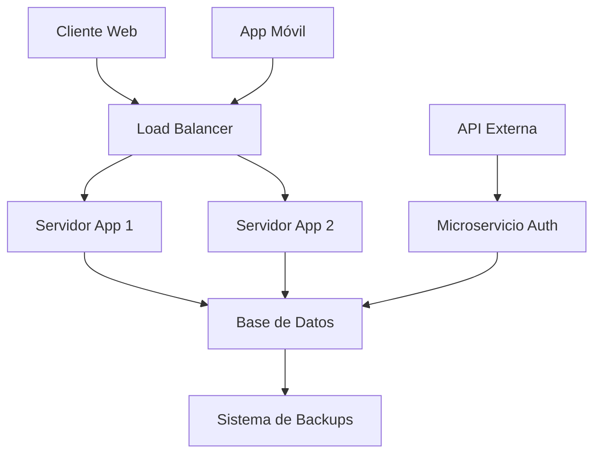

# 📋 Sistema de Gestión Escolar - CotareloManage

> Un sistema completo para la gestión de centros educativos modernos.

## 🎯 Descripción General

CotareloManage es una plataforma innovadora diseñada para facilitar la administración de instituciones educativas. Combina tecnología avanzada con una interfaz intuitiva para optimizar los procesos académicos y administrativos.

## ✨ Características Principales

- Gestión de estudiantes y profesorado
- Dashboard interactivo con métricas en tiempo real
- Sistema de calificaciones automatizado
- Comunicación integrada entre padres, estudiantes y docentes
- Reportes personalizables y análisis estadísticos

## 📊 Estadísticas del Proyecto

| Métrica              | Valor  | Estado       |
| -------------------- | ------ | ------------ |
| Usuarios activos     | 15,247 | ✅ Activo    |
| Colegios registrados | 342    | 📈 Creciendo |
| Uptime               | 99.9%  | 🟢 Excelente |
| Satisfacción         | 4.8/5  | ⭐ Muy alta  |

## 🏗 Arquitectura del Sistema

## 📈 Crecimiento de Usuarios
La ecuación que modela nuestro crecimiento es:

$$
U(t) = U_0 \cdot e^{rt}

$$

Donde:

- U (t) = usuarios en el tiempo t

- U0 = usuarios iniciales (500)

- r = tasa de crecimiento (0.15 mensual)

- t = tiempo en meses

El **ROI** (Return on Investment) se calcula como:  

$$
ROI = \frac{Beneficio - Inversión}{Inversión} \times 100
$$

## 🔧 Tecnologías Utilizadas

**Frontend**

- **React.js** v18.2.0

- Material-UI para componentes

- **TypeScript** para tipado estático

**Backend**

- Node.js con Express

- **MongoDB** como base de datos

- JWT para autenticación

## 📝 Lista de Tareas Pendientes

- [x] Implementar sistema de login

- [x] Crear dashboard principal

- [ ] Añadir módulo de **calificaciones**

- [ ] Integrar sistema de notificaciones

- [ ] Desarrollar app móvil

- [ ] Implementar **analytics** avanzados

## 🤝 Contribuir al Proyecto

¿Quieres ayudar? ¡Genial! Sigue estos pasos:
1. Haz un fork del repositorio
2. Crea una rama para tu **feature**: git checkout -b nueva-funcionalidad
3. Realiza tus cambios y haz commit
4. Envía un **pull request**

## 📧 Contacto y Soporte

Email: soporte@CotareloManage.es

Slack: cotarelomanage.slack.com

Documentación: docs.CotareloManage.es

## 📜 Licencia

Proyecto bajo licencia MIT.

---

## ⚙️ `instalacion.md`
Basado en :contentReference[oaicite:1]{index=1}  

(Contiene comandos, pasos y Docker Compose con sintaxis Markdown).

---

## 🔐 `login.md`
Basado en :contentReference[oaicite:2]{index=2}  
Incluye el **diagrama de secuencia** en Mermaid y la descripción de seguridad y usuarios.

---

## 📊 `dashboard.md`
Basado en :contentReference[oaicite:3]{index=3}  
Incluye el **gráfico de sectores** y **gráfico de barras** Mermaid, además de la tabla de KPIs y roles con permisos JSON.

---

## ⚙️ `settings.md`
Basado en :contentReference[oaicite:4]{index=4}  
Incluye la descripción del módulo y las **fórmulas matemáticas** en LaTeX.

---

¿Quieres que te genere **los cinco archivos Markdown completos listos para subir al repositorio** (`README.md`, `instalacion.md`, `login.md`, `dashboard.md`, `settings.md`)?  
Así podrías copiarlos directamente a tu proyecto.

Desarrollado con ❤️ por el equipo de CotareloManage.

## Caracteres Especiales y Escapado
Para mostrar caracteres especiales en Markdown:
Asterisco literal: *no es cursiva*

Almohadilla literal: # no es título

Barra invertida literal: \

Backtick literal: `no es código`

¡Gracias por usar CotareloManage! 🎓